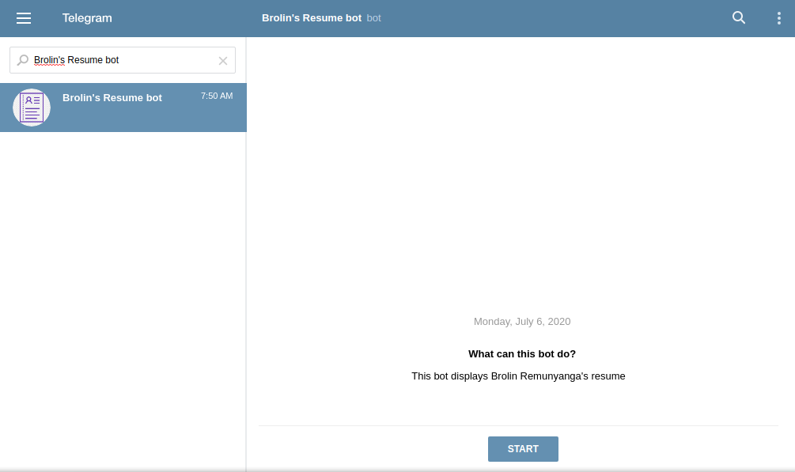

# Brolin's Resume bot
A telegram bot working as a personal resume

# By Brolin Remunyanga

## Introduction

**Brolin's Resume bot** is a telegram bot which can be interacted with to get details about me. If needed you can ask the bot to send a document containing my resume as an image.

## Content

+ Installation.
+ Running.
+ Using within telegram.
+ About the project.
+ Contact.

## Installation

1. Click the repository's clone or download button and copy the https link.
2. Open a terminal on your machine.
2. Within the terminal, navigate to the directory or make one for the bot files.

    **In windows by using:**
    ```
    cd directory
    ```
    To go to a directory
    If you don't know the name of a directory, use:
    ```
    dir
    ```
    To see the available directories and files within the one you're currently at.

    **In an unix terminal using:**
    ```
    cd directory
    ```
    To go to a directory
    If you don't know the name of a directory, use:
    ```
    ls
    ```
    To see the available directories and files within the one you're currently at.

3. Do git clone (Shift+Ctrl+v) to download the files into the current directory.
4. Change into the new directory created by the git clone command.
5. Install the required gems with bundler. For both operating systems do:
    ```
    bundle
    ```

## Running

1. Open a terminal.

2. Within the terminal, navigate to the bot's bin directory

## In windows by using:
```
cd directory
```


To go to a directory If you don't know the name of a directory, use:
```
dir
```

To see the available directories and files within the one you're currently at.

## In an unix terminal using:
```
cd directory
```

To go to a directory If you don't know the name of a directory, use:
```
ls
```
To see the available directories and files within the one you're currently at.

3. Run the bot

## In windows:
```
ruby tele-bot.rb
```

## In a unix terminal:
```
ruby tele-bot.rb
```

Please note that if you close the terminal or shut down the system, the bot will stop working.

# Using the bot in Telegram
1. Install telegram on your phone or desktop(Telegram has a full working desktop version which does not require a mobile phone installation.)
2. Create a personal account.
3. Once signed in, go to the telegram's searchbar and search for @Brolin's Resume bot. 

4. Select the result "Brolin's Resume bot" shown in the image above.

5. The bot has only nine commands which are:

+ /start
+ /aboutme
+ /skills
+ /education
+ /hobbies
+ /projects
+ /contact
+ /resume
+ /help

6. To interact with the bot type in a command preceded by a /.This starts the bot, which will greet the user by it's name and provide the available commands.

# About the project

+ Built using Ruby v 2.7.0
+ The editor used was VS Code
+ Git and Github were used for version control
+ Built using the telegram-bot-ruby gem.
+ This was build as an inspiration of Tennyson Zvaita's micro bot.

# Thanks
+ https://www.sitepoint.com/quickly-create-a-telegram-bot-in-ruby/
+ Telegram 
+ Tennyson. T. Zvaita who inspired me on this project

# Contact
For more information or help with this project please contact
Brolin Remunyanga at remunyangabrolin@gmail.com 